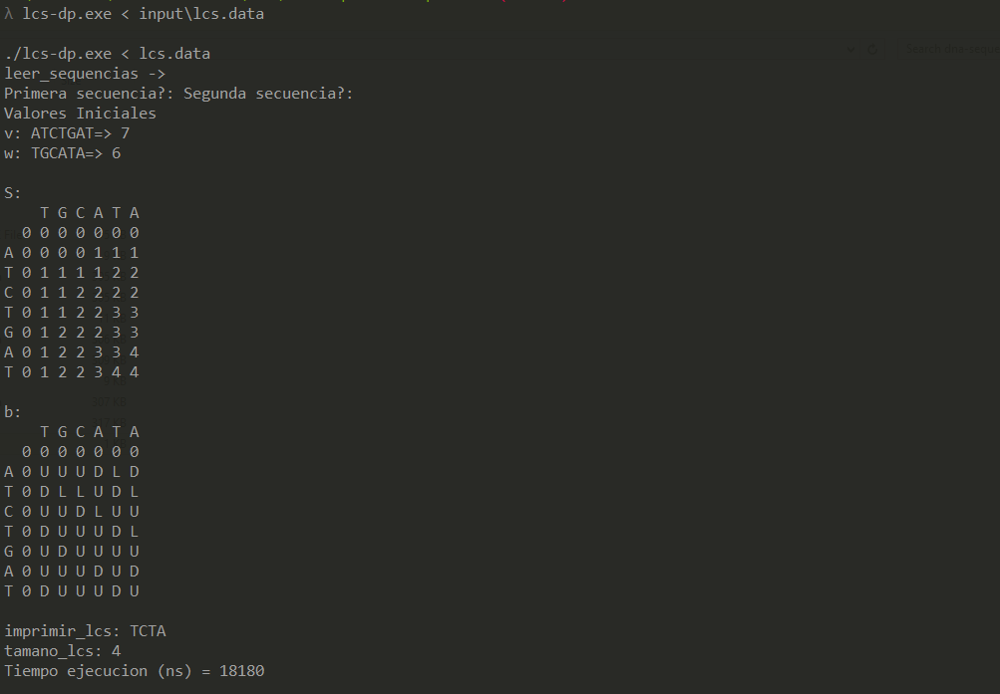

# DNA Sequence Comparison on Bioinformatics

C++ Implementations of the algorithms: Hamming Distance, Longest Common Subsequence, Global Alignment & Local Alignment. 

  

## Data
input/lcs.data

## Structure
<pre>
	/lcs-dp.cpp - Longest Common Subsequence (DP)
	/ga.cpp - Global Alignment
	/la.cpp - Local Alignment
	basic/hamming-distance.cpp - Hamming Distance
	basic/lcs-recursivo.cpp - Longest Common Subsequence (Recursive)
</pre>

## Compilation (x64 Native Tools Command Prompt for VS 2017 or g++)
cl srs.cpp  
g++ lcs-dp.cpp -O3 -o srs

## Execution
./lcs-dp.exe < input\lcs.data  

## Results
 

 
 

## Downloads
- All: https://github.com/nextco/dna-sequence-comparison/archive/master.zip
